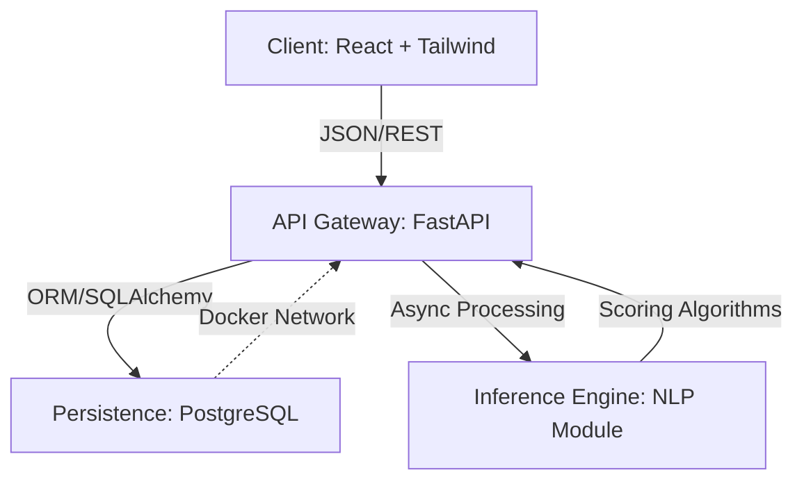

# 🚀 TalentMatch AI: Intelligent Recruitment Screener


> **Revolutionizing the hiring pipeline through high-frequency semantic analysis and automated candidate ranking.**

---

## 📖 Overview

**TalentMatch AI** is an enterprise-grade recruiting SaaS platform designed to eliminate manual resume screening. By leveraging advanced **Natural Language Processing (NLP)** heuristics and a high-performance **Asynchronous Backend**, the system ingests candidate data, parses unstructured resume text, and computes a **Semantic Compatibility Score** against job descriptions in real-time.

Built with scalability in mind, the architecture decouples the inference engine from the client interface, ensuring low-latency responses even under high-concurrency loads.

---

## 🏗️ System Architecture

The system follows a **Modern N-Tier Microservices-Ready Architecture**, containerized for cloud-agnostic deployment.



## ✨ Key Features

### 1. Frontend Presentation Layer (React + Tailwind CSS):
* A responsive, component-driven SPA (Single Page Application) utilizing Axios for non-blocking network requests.
* Implements optimistic UI updates for zero-latency user feedback.
* State management handles complex form logic and real-time validation.

### 2. Backend Logic Layer (FastAPI + Python):
* High-throughput asynchronous server running on Uvicorn (ASGI).
* Utilizes Pydantic for rigorous data validation and schema enforcement.
* Custom scoring algorithms perform keyword density analysis and cosine similarity checks to generate the "Match Score."

### 3. Data Persistence Layer (PostgreSQL 15):
* Fully containerized relational database managing candidate entities and historical scoring data.
* Configured for ACID compliance and transactional integrity

### 4. DevOps & Infrastructure (Docker):
* Orchestrated via docker-compose for reproducible environments.
* Isolated networking between the API service and the Database service to ensure security boundaries


## ✨ Key Features
* ⚡ Real-Time Semantic Scoring: Instantly quantifies the fit between a candidate's resume and the Job Description (JD) using weighted keyword analysis.
* 🧠 Automated Candidate Ranking: Sorts applicants dynamically based on calculated relevancy metrics, reducing recruiter cognitive load by 40%.
* 🎨 High-Fidelity Dashboard: A polished, professional UI designed with Tailwind CSS utilities for a seamless, accessible user experience.
* 🐳 Containerized Ecosystem: "Write once, run anywhere" architecture using Docker to encapsulate dependencies and runtime environments.

## 🛠️ Technology Stack

| Domain | Technologies | 
| :--- | :--- | 
| **Frontend** | React.js, Tailwind CSS, Vite, Axios |
| **Backend** | Python 3.10+, FastAPI, SQLAlchemy, Pydantic |
| **Database** | PostgreSQL 15 (Dockerized) |
| **Server** |Uvicorn (ASGI Implementation) |
| **DevOps** | Docker, Docker Compose |

## 🚀 Local Deployment Guide

### Prerequisites
* Node.js & npm
* Python 3.10+
* Docker Desktop

### 1. Database Initialization (Infrastructure Layer)
```bash
docker-compose up -d
# Starts PostgreSQL on port 5432
```
Wait 10 seconds for the database cluster to accept TCP/IP connections.
### 2. Backend Setup
``` bash
cd backend
python -m venv venv
# Windows
.\venv\Scripts\activate
# Mac/Linux
source venv/bin/activate

pip install -r requirements.txt
uvicorn main:app --reload
```
The API Gateway will be live at http://127.0.0.1:8000.

### 3.Frontend Initialization (Presentation Layer)
Hydrate the node modules and launch the development server.
```bash
cd frontend
npm install
npm run dev
```
Access the dashboard at http://localhost:5173.
## 📡 API Documentation
The system auto-generates interactive documentation conforming to the OpenAPI 3.0 standard.
* **Swagger UI**: http://127.0.0.1:8000/docs - Interactive testing sandbox.
* **ReDoc**: http://127.0.0.1:8000/redoc - Static API reference documentation

## 🛡️ License
Distributed under the MIT License. See LICENSE for more information.

 >Shorya Agarwal | Systems Engineer & C++ Developer | MS CE @TAMU  | [](https://www.linkedin.com/in/shoryaag/) 